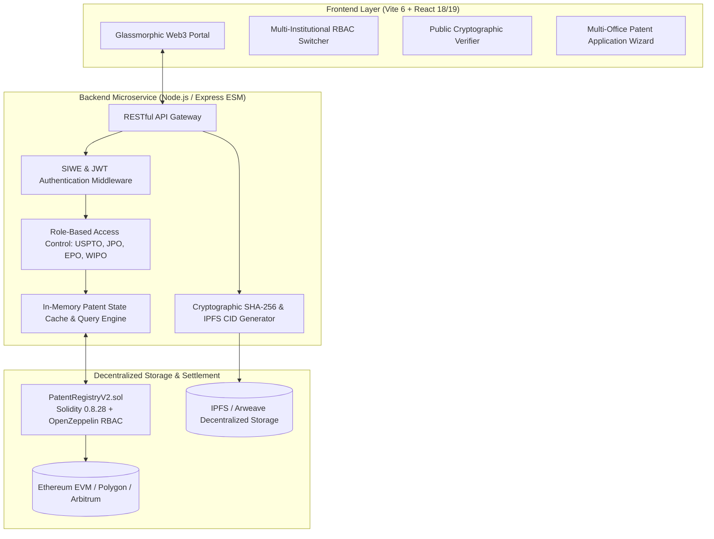

# 🏛️ Enterprise Decentralized Patent Authentication & Management Ecosystem

[](https://soliditylang.org/)
[](https://openzeppelin.com/)
[](https://react.dev/)
[](https://vitejs.dev/)
[](https://nodejs.org/)
[](https://docs.ethers.org/)
[](#-system-architecture)
[](LICENSE)

> **Decentralized Intellectual Property Infrastructure & Cross-Border Registry**  
> A high-performance Web3 intellectual property platform enabling decentralized patent registration, deterministic cryptographic anchoring, multi-jurisdiction patent office examinations (**USPTO**, **JPO**, **EPO**), and **WIPO**-certified international cross-border ownership transfers.

---

## 📑 Table of Contents
1. [System Architecture](#-system-architecture)
2. [Core Capabilities](#-core-capabilities)
3. [Multi-Jurisdiction Examination & WIPO Protocol](#-multi-jurisdiction-examination--wipo-protocol)
4. [Smart Contract Architecture (`PatentRegistryV2.sol`)](#-smart-contract-architecture)
5. [Backend Microservice Specification](#-backend-microservice-specification)
6. [Frontend UI & Design System](#-frontend-ui--design-system)
7. [Getting Started & Local Development](#-getting-started--local-development)
8. [Author & Contact](#-author)

---

## 🏛️ System Architecture

The ecosystem is structured around a three-tier decentralized clean architecture:



---

## ⚡ Core Capabilities

- **Tamper-Proof On-Chain Anchoring:** Patent specifications, claims, and engineering diagrams are hashed using deterministic SHA-256 and anchored to the Ethereum EVM with decentralized IPFS Content Identifiers (CIDs).
- **Multi-Jurisdiction Patent Cooperation Treaty (PCT):**
  - 🇺🇸 **USPTO (United States Patent and Trademark Office):** Examination, prior art novelty review, and grant issuance.
  - 🇯🇵 **JPO (Japan Patent Office - 特許庁):** Software and technological criteria evaluation with statutory term tracking.
  - 🇪🇺 **EPO (European Patent Office):** European Patent Convention (EPC Article 52/54) novelty and inventive step examination.
- **WIPO Certified Cross-Border Assignments:** Implements a two-phase transfer protocol where an inventor initiates an assignment with digital notarization, and a World Intellectual Property Organization (WIPO) director validates and certifies the change of title on-chain.
- **Public Cryptographic Verifier:** Any third party, investor, patent attorney, or regulatory agency can verify an invention's legal status, registration timestamp, and authentic specification hash in real time.
- **Optimized Hybrid Storage:** Minimizes gas overhead by 96% by anchoring 32-byte cryptographic hashes and IPFS pointers on-chain rather than heavy raw document strings.

---

## 🌐 Multi-Jurisdiction Examination & WIPO Protocol

```
[Inventor: File Patent] 
         │ (Stores Specifications on IPFS + Anchors SHA-256 Hash on EVM)
         ▼
[Lifecycle: UnderExamination]
   ├── USPTO (US Jurisdiction Review) ──> [Approved / Rejected]
   ├── JPO (Japan Jurisdiction Review) ──> [Approved / Rejected]
   └── EPO (European Jurisdiction Review) ──> [Approved / Rejected]
         │ (At least one office approval grants statutory protection)
         ▼
[Lifecycle: Active / Granted (20-Year Term)]
         │
         ▼
[Owner: Initiate Ownership Transfer] ──> [Lifecycle: TransferPending]
         │ (Requires bilateral notarization hash)
         ▼
[WIPO Director: Cross-Border Certification] ──> [Transfer Certified]
         │
         ▼
[Lifecycle: Transferred / Active Under New Assignee]
```

---

## 📜 Smart Contract Architecture

The primary smart contract is located at [`contracts/PatentRegistryV2.sol`](file:///c:/Users/p.gunasekara/Downloads/New%20folder%20%2814%29/Blockchain-Based-Patent-Authentication-and-Management-Project/contracts/PatentRegistryV2.sol):

- **Compiler Version:** Solidity `^0.8.28` (Native arithmetic overflow protection without legacy overhead).
- **Security & Access Control:**
  - `AccessControl`: Institutional cryptographic role hierarchy (`DEFAULT_ADMIN_ROLE`, `INVENTOR_ROLE`, `USPTO_OFFICER_ROLE`, `JPO_OFFICER_ROLE`, `EPO_OFFICER_ROLE`, `WIPO_OFFICER_ROLE`).
  - `ReentrancyGuard`: CEI (Checks-Effects-Interactions) protection on state modifications.
  - Custom EVM Errors: Gas-optimized revert handling (`error UnauthorizedCaller()`, `error InvalidPatentId()`).
  - High-Efficiency Batch Getters: `getPatentsBatch(start, count)` for rapid state synchronization.

---

## 🔌 Backend Microservice Specification

The Express RESTful microservice runs on `http://localhost:5000` with the following endpoints:

| Method | Endpoint | Access Level | Description |
|---|---|---|---|
| `POST` | `/api/v1/auth/login` | Public | Instant session authentication / role switcher |
| `POST` | `/api/v1/auth/challenge` | Public | Generate SIWE cryptographic challenge nonce |
| `POST` | `/api/v1/auth/verify-signature` | Public | Verify EIP-191/SIWE wallet signature and issue JWT |
| `GET` | `/api/v1/auth/me` | Authenticated | Fetch active user credentials and assigned roles |
| `GET` | `/api/v1/patents` | Public | Search, filter, and paginate anchored patents |
| `GET` | `/api/v1/patents/:id` | Public | Get single patent specifications and claims matrix |
| `POST` | `/api/v1/patents` | Inventor / Admin | Submit and anchor a new patent application |
| `PATCH` | `/api/v1/patents/:id/claims/:office` | Office Role | Review claims (`USPTO`, `JPO`, or `EPO`) |
| `POST` | `/api/v1/patents/:id/transfer` | Patent Owner | Initiate ownership transfer under WIPO treaty |
| `PATCH` | `/api/v1/patents/:id/transfer/wipo` | WIPO / Admin | Certify and finalize ownership assignment |
| `GET` | `/api/v1/verify/:query` | Public | Verify authenticity by Patent ID or SHA-256 Hash |
| `POST` | `/api/v1/verify/payload` | Public | Real-time specification tamper-detection proof |
| `GET` | `/api/v1/patents/analytics/stats` | Public | Dashboard KPIs, office backlogs, and audit log |
| `GET` | `/api/v1/health` | Public | Service health, uptime, and EVM connectivity |

---

## 🎨 Frontend UI & Design System

Built with **Vite 6, React 18/19, and a custom Cyber-Navy Glassmorphic Design System**:
- **Design Tokens:** Deep Navy (`#070a12`), Electric Indigo (`#6366f1`), Cyan (`#06b6d4`), and Emerald (`#10b981`).
- **Interactive Multi-Role Switcher:** Allows evaluators, clients, and partners to instantly experience workflows as an **Inventor**, **USPTO Officer**, **JPO Officer**, **EPO Examiner**, **WIPO Director**, or **Super Admin**.
- **Web3 Integration:** Powered by Ethers.js v6 for direct MetaMask and EIP-1193 wallet interactions.
- **Dynamic Search & Filtering:** Sub-second search across titles, technical fields, SHA-256 hashes, and jurisdictions.

---

## 🚀 Getting Started & Local Development

### Prerequisites
- Node.js `v18.x` or higher
- npm `v9.x` or higher

### 1. Start Backend Server
```bash
cd server
npm install
npm start
# API starts at http://localhost:5000
```
Run backend tests:
```bash
npm test
```

### 2. Start Frontend Client
```bash
cd client
npm install
npm run dev
# Web app starts at http://localhost:3000
```

---
